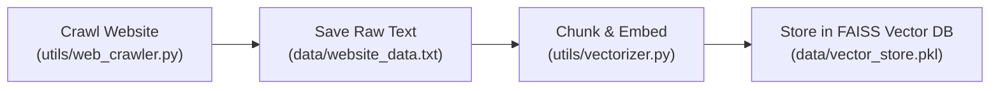
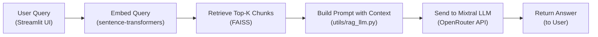

<<<<<<< HEAD
# 🤖 JivaBot – RAG-Based AI Chatbot for Jiva Infotech (Hyderabad)

JivaBot is a **lightweight but powerful chatbot** that answers user questions based on real content scraped from [jivainfotech.com](https://www.jivainfotech.com/). It uses **web crawling**, **vector search**, and **Mixtral 8x7B via OpenRouter** to provide **highly relevant answers** in real-time with full chat history.

---

## 🚀 Features

✅ Streamlit UI with chat history  
✅ Web crawling from Jiva Infotech website  
✅ FAISS vector search using embeddings  
✅ RAG (Retrieval-Augmented Generation)  
✅ Mixtral LLM via OpenRouter API (only key needed)  
✅ Fully open-source stack  
✅ Clean, readable codebase

---

## 🧱 Project Structure

JivaBot/
├── app/
│ └── main.py # Streamlit UI with chat interface
│
├── data/
│ └── website_data.txt # Crawled raw text
│ └── vector_store.pkl # FAISS vector database
│
├── utils/
│ ├── web_crawler.py # Scrapes the website
│ ├── vectorizer.py # Chunks text & builds embeddings
│ └── rag_llm.py # RAG logic using Mixtral
│
├── secrets/
│ └── openrouter_api_key.txt # Store your OpenRouter API key here
│
├── requirements.txt
├── README.md
└── copilot-instructions.md


---

## 🛠️ Tech Stack

| Component         | Tool / Library                      |
|------------------|-------------------------------------|
| UI               | Streamlit                           |
| Crawling         | requests + BeautifulSoup             |
| Embeddings       | sentence-transformers (`all-MiniLM`)|
| Vector DB        | FAISS                               |
| LLM              | Mixtral 8x7B via OpenRouter          |
| Chat Logic       | Python, Prompt Engineering           |
| Deployment       | Localhost via Streamlit              |

---

## 🔐 API Key Setup

1. Create a free account at: [https://openrouter.ai](https://openrouter.ai)  
2. Copy your API key.  
3. Paste it into a new file:

```txt
# secrets/openrouter_api_key.txt
sk-openrouter-xxxxxxxxxxxxxxxxxx
```

---

## 🧠 How RAG Works

RAG = Retrieval-Augmented Generation

1. Crawl and clean website content
2. Break into small chunks (400 tokens)
3. Embed using Sentence Transformers
4. Store in FAISS (vector search index)

On user query:

1. Embed query
2. Retrieve Top-K similar chunks
3. Build prompt:

```
You are a helpful bot. Use this context to answer:

{{ top_chunks }}

Question: {{ user query }}
```

4. Send to Mixtral via OpenRouter
5. Return response to user

---

## 🧪 How to Run

```bash
git clone https://github.com/yourname/JivaBot.git
cd JivaBot

# Create virtual environment
python -m venv venv
source venv/bin/activate  # or venv\Scripts\activate on Windows

# Install dependencies
pip install -r requirements.txt

# Step 1: Crawl the site
python utils/web_crawler.py

# Step 2: Build vector store
python utils/vectorizer.py

# Step 3: Launch chatbot
streamlit run app/main.py
```

---

## 💬 Chat Interface

- Message style like WhatsApp
- Scrollable full history
- Answers backed by actual crawled content
- Optional context preview toggle

---

## 🔒 Warning

- Only queries related to Jiva Infotech will return results
- This bot is a demo; not for production deployment without QA testing

---

# JivaBot - Documentation

## Summary

JivaBot is a [brief description of the application's purpose]. It allows users to [list key features and functionalities].

This documentation provides a comprehensive guide to using and understanding JivaBot, including API details and workflow diagrams.

## Table of Contents

1.  [API Documentation](#api-documentation)
2.  [Workflow Diagrams](#workflow-diagrams)

## API Documentation

### 1. /crawl (Crawl Website)
- **Method:** `python utils/web_crawler.py`
- **Description:** Crawls the Jiva Infotech website and saves raw text to `data/website_data.txt`.
- **Parameters:** None (URL is hardcoded in script)
- **Response:**
  - `website_data.txt` file updated with latest content.

### 2. /vectorize (Build Vector Store)
- **Method:** `python utils/vectorizer.py`
- **Description:** Chunks crawled text, generates embeddings, and stores them in FAISS (`data/vector_store.pkl`).
- **Parameters:** None (input file is `website_data.txt`)
- **Response:**
  - `vector_store.pkl` file created/updated.

### 3. /chat (Chatbot Inference)
- **Method:** `streamlit run app/main.py`
- **Description:** Launches the chatbot UI. Handles user queries, retrieves relevant context, and generates answers using Mixtral LLM via OpenRouter.
- **Parameters:**
  - `user_query` (string): The user's question.
- **Response:**
  - JSON with fields:
    - `answer`: The generated answer.
    - `context`: (optional) The retrieved context chunks.
    - `history`: Full chat history.

---

## Workflow Diagrams

### 1. Data Preparation Workflow



### 2. Chatbot Query Workflow



=======
# jivabot
>>>>>>> 6eb5fa14fa7bd025be83eccd01e7bb8c3bad9c34
