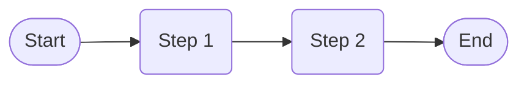

# JivaBot Workflow Diagrams

## Workflow 1: [Workflow Name]

```mermaid
graph LR
    A([Start]) --> B{[Decision Point]};
    B -- Yes --> C[Action 1];
    B -- No --> D[Action 2];
    C --> E([End]);
    D --> E;
```

[Describe the workflow in detail. Explain each step and decision point.]

## Workflow 2: [Workflow Name]



[Describe the workflow in detail. Explain each step.]

[Add more workflows as needed, using Mermaid syntax to create diagrams.]
